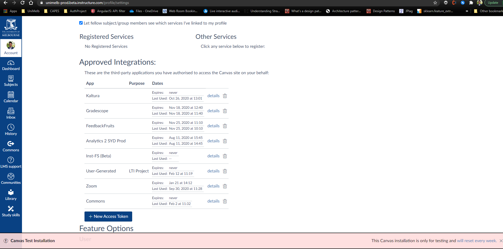
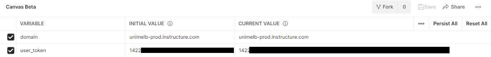
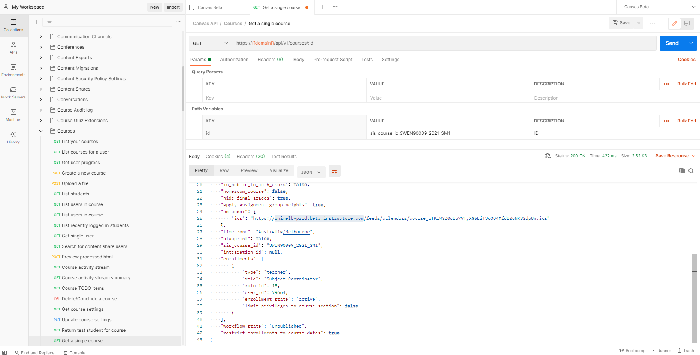

# **[LTI] Canvas**

### Resources

Canvas API ([https://canvas.instructure.com/doc/api/index.html](https://canvas.instructure.com/doc/api/index.html)) (data that is available to us in Canvas)

Canvas Data ([https://portal.inshosteddata.com/docs](https://portal.inshosteddata.com/docs) - ETL facts and dimensions) (data that is available to us in Canvas)

### Accessing Canvas API

Best way to start accessing/exploring the API is through Postman [https://www.postman.com/downloads/]

- create an environment "Canvas Prod"
  - access: unimelb-prod.instructure.com
  - generate a user\_token on Canvas: Account >> Settings >> + New Access Token

  - add the generated key to Postman

  - if user\_token is created in Canvas Production, that&#39;ll become available on the next Monday.

  - Once the environment is created, IMPORT [this](https://github.com/agogear/lti2021/blob/main/docs/json/output.json) JSON file to Postman (Collections)
  - all the API will be available to access courses that you have access in Canvas

## Canvas API

canvasapi : [https://github.com/ucfopen/canvasapi](https://github.com/ucfopen/canvasapi)

another example : [https://github.com/shaananc/unimelb-teaching-tools](https://github.com/shaananc/unimelb-teaching-tools)
